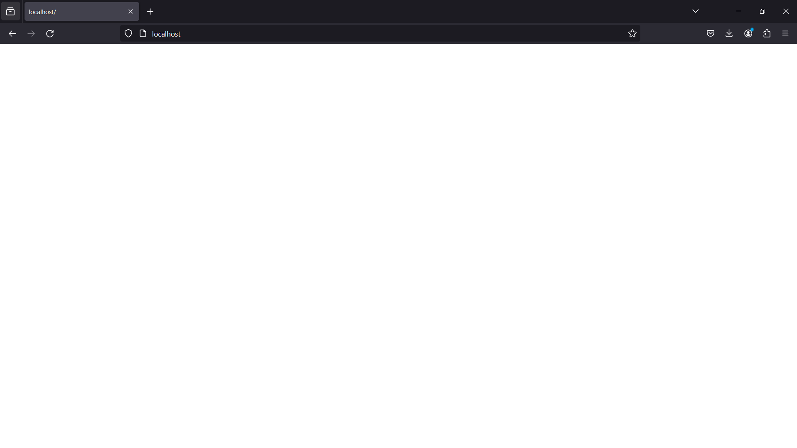
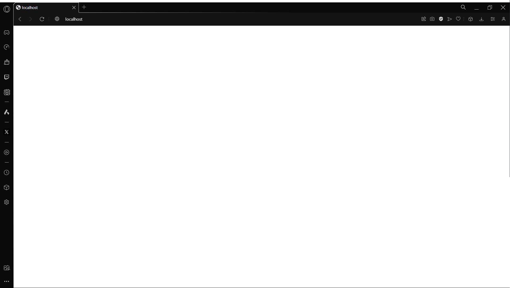
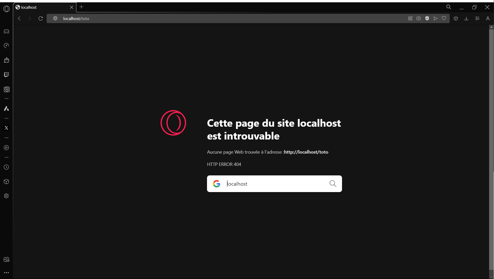
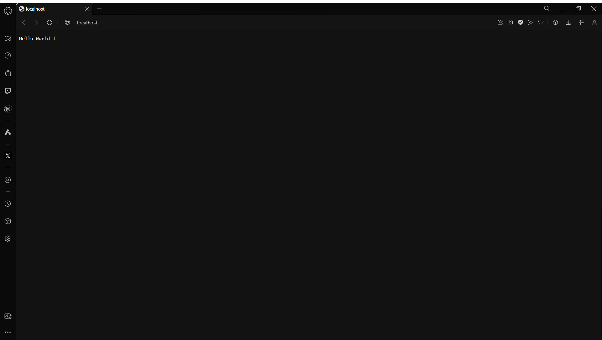
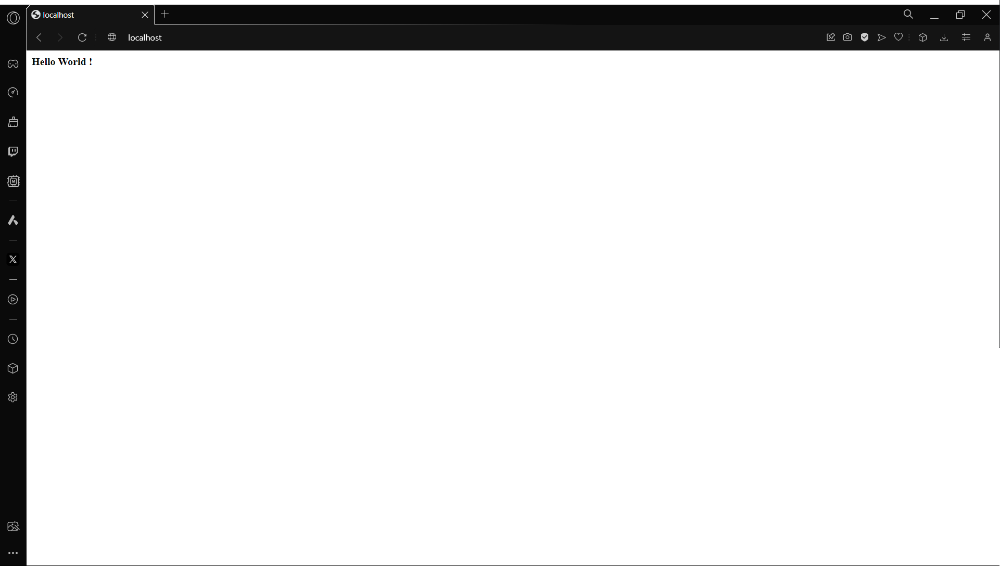
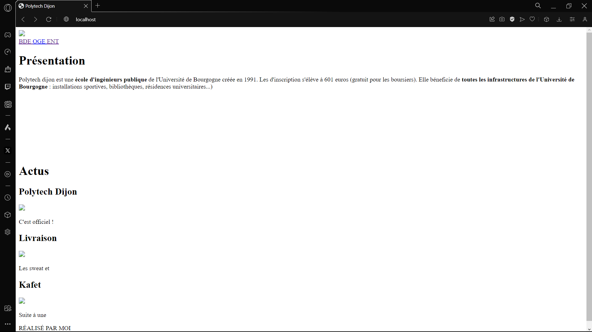
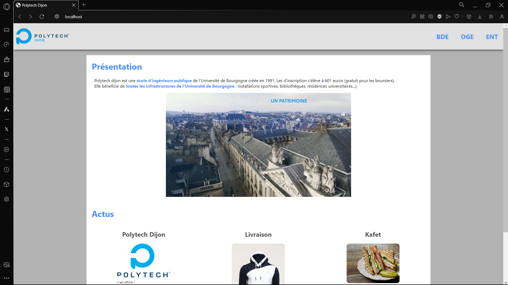
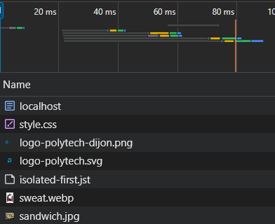

###### Nicolas METAIS

Ce compte rendu est réalisé le ReadMe de mon <a href=https://github.com/nicopyright/JAVA-TD2> repository github </a>.

# Compte Rendu de TP Java


### Objectif

- Etudier et reproduire le comportement d’un serveur web

- Manipuler les sockets

- Manipuler les fichiers

- Créer une application multithread

## CE N’EST PAS UNE CHAUSSETTE
Création des différentes classes:

### WebServer.java :
```JAVA
public class WebServer {
    private void readRequest(Socket socket) {

        try {
            BufferedReader input = new BufferedReader(new InputStreamReader(socket.getInputStream()));
            String response = "";
            do {
                response = input.readLine();
                System.out.println(response);
            }while (!(response).isEmpty());
        }
        catch(Exception e){
            System.err.println(e.getMessage());
        }
    }

    private void sendResponse(Socket socket) {
        try {
            BufferedWriter output = new BufferedWriter(new OutputStreamWriter(socket.getOutputStream()));
            output.write("HTTP/1.1 200 OK \n\n ");

            output.flush();
        } catch (Exception e) {
            System.err.println(e.getMessage());
        }
    }
    public void run(int portNumber) {
        try {
            ServerSocket serverSocket = new ServerSocket(portNumber);
            System.out.println("Starting server on port " + portNumber);
            while (true) {
                Socket clientSocket = serverSocket.accept();
                readRequest(clientSocket);
                sendResponse(clientSocket);
                clientSocket.close();
            }

        } catch (Exception e) {
            System.err.println(e.getMessage());
        }

    }
}
```
### WebServerApplication.java :
```JAVA
public class WebServerApplication {
    public static void main(String[] args) {
        WebServer webServer = new WebServer();
        webServer.run(80);
    }
}
```

On obtient bien alors une page blanche sur le navigateur.



et sur le terminal on obtient :
```
Starting server on port 80
GET / HTTP/1.1
Host: localhost
User-Agent: Mozilla/5.0 (Windows NT 10.0; Win64; x64; rv:124.0) Gecko/20100101 Firefox/124.0
Accept: text/html,application/xhtml+xml,application/xml;q=0.9,image/avif,image/webp,*/*;q=0.8
Accept-Language: fr,fr-FR;q=0.8,en-US;q=0.5,en;q=0.3
Accept-Encoding: gzip, deflate, br
Connection: keep-alive
Upgrade-Insecure-Requests: 1
Sec-Fetch-Dest: document
Sec-Fetch-Mode: navigate
Sec-Fetch-Site: none
Sec-Fetch-User: ?1
```

La requete client contient :

- une requete GET / HTTP/1.1 

- avec comme url : localhost
- le client accepte les fichiers :
  - text/html 
  - application/xhtml+xml 
  - application/xml;q=0.9 
  - image/avif
  - image/webp
  - \*/*;q=0.8
- le champ connection en keep-alive traduit le fait que le client souhaite garder la connexion ouverte pour d'autres requetes


## REORGANISATION
On implémente les différentes classes.
### httpRequest.java :
```JAVA
public class HttpRequest {
    private String method;
    private String url;
    private void readClientRequest(Socket socket){
        try {
            BufferedReader input = new BufferedReader(new InputStreamReader(socket.getInputStream()));
            String line = "";
            String response = "";
            do {
                line = input.readLine();
                response += line;
            }while (!line.isEmpty());
            String[] request = response.split(" ");
            this.method = request[0];
            this.url = request[1];
        }
        catch(Exception e){
            System.err.println(e.getMessage());
        }
    }
    public HttpRequest(Socket socket){
        readClientRequest(socket);
    }
    public String getMethod(){
        return method;
    }
    public String getUrl(){
        return url;
    }
}
```
### httpResponse.java :
```JAVA
public class HttpResponse {
    private BufferedWriter output;
    
    public HttpResponse(Socket socket) {
        try {
            output = new BufferedWriter(new OutputStreamWriter(socket.getOutputStream()));
        } catch (Exception e) {
            System.err.println(e.getMessage());
        }
    }
    public void ok(String message){
        try {
            output.write("HTTP/1.1 200 " + message + " \n\n");
            output.flush();
        } catch (Exception e) {
            System.err.println(e.getMessage());
        }
    }
    public void notFound(String message){
        try {
            output.write("HTTP/1.1 404 " + message + " \n\n");

            output.flush();
        } catch (Exception e) {
            System.err.println(e.getMessage());
        }
    }
}
```
### httpContext.java :
```JAVA
public class HttpContext {
    private Socket socket;
    private HttpRequest request;
    private HttpResponse response;
    
    public HttpContext(Socket socket) {
        this.socket = socket;
        request = new HttpRequest(socket);
        response = new HttpResponse(socket);
    }

    public HttpRequest getRequest() {
        return request;
    }

    public HttpResponse getResponse() {
        return response;
    }

    public void close() {
        try {
            socket.close();
        } catch (Exception e) {
            System.err.println(e.getMessage());
        }
    }
}
```
### requestProcessor.java :
```JAVA
public class RequestProcessor {
    private HttpContext context;
    private void process(){
        if(context.getRequest().getUrl().equals("/")){
            context.getResponse().ok("OK");
        }
        else{
            context.getResponse().notFound("Not Found");
        }
        context.close();
    }
    public RequestProcessor(Socket socket) {
        context = new HttpContext(socket);
        process();
    }
}
```
### webServer.java :
```JAVA
public class WebServer {
    public void run(int portNumber) {
        try {
            ServerSocket serverSocket = new ServerSocket(portNumber);
            while (true) {
                Socket socket = serverSocket.accept();
                RequestProcessor requestProcessor = new RequestProcessor(socket);
            }
        } catch (Exception e) {
            System.err.println(e.getMessage());
        }
    }
}
```
### RESULTATS

On obtient alors des résultats différents selon si l'url est / ou non.



- Si l'url est / on obtient un code 200 OK



- Si l'url est /toto (par exemple) on obtient un code 404 Not Found


## UN PEU DE CONTENNU

On va maintenant ajouter du contenu à notre serveur web.

### A LA MANO

On va envoyer une reponse HTTP avec seulement du text comme contenu pour l'instant.
```JAVA
public class RequestProcessor {
    private HttpContext context;
    private void process(){
        if(context.getRequest().getUrl().equals("/")){
            context.getResponse().ok("OK");
            context.getResponse().sendContent("text/plain", "Hello World !");
        }
        else{
            context.getResponse().notFound("Not Found");
        }
        context.close();
    
    
    }
    public RequestProcessor(Socket socket) {
        context = new HttpContext(socket);
        process();
    }
}
```
```JAVA
 public void sendContent(String contentType, String content){
        try {
            output.write("Content-Type: " + contentType + "\n");
            output.write("Content-Length: " + content.length() + "\n");
            output.write("\n" + content);
            output.flush();
        } catch (Exception e) {
            System.err.println(e.getMessage());
        }
    }
```


En changeant le contentType en text/html pour obtenir une page web :

```JAVA
context.getResponse().sendContent("text/html", "Hello World !");
```
Aucune diffrence...

Avec les balises HTML c'est mieux !

```JAVA
context.getResponse().sendContent("text/html", "<body><strong> Hello World !</strong></body>");
```
On obtient alors un texte en gras :



### AVEC DES FICHIER
On va maintenant envoyer des fichiers au lieu d'envoyer le text à la main.

Création de sendFile dans HttpResponse.java
```JAVA
public void sendFile(String contentType, String filename){

    try {
        File file = new File(filename);
        FileInputStream input = new FileInputStream(filename);
        byte[] bytes = new byte[4096];
        int bytesRead = 0;
        output.write(("Content-Type: " + contentType + "\n").getBytes());
        output.write(("Content-Length: " + file.length() + "\n").getBytes());
        output.write(("\n").getBytes());
        do {
            bytesRead = input.read(bytes);
            if (bytesRead > 0) {
                output.write(bytes, 0, bytesRead);
            }
        } while (bytesRead == 4096);
        output.flush();
    } catch (Exception e) {
        System.err.println(e.getMessage());
    }
}
```
Dans RequestProcessor.java on remplace l'enovoi de text par l'envoi de fichier si l'url est " / " :
```JAVA
if(f.getPath().equals("/")){
    context.getResponse().ok("OK");
    //context.getResponse().sendContent("text/html", "<body><strong> Hello World !</strong></body>");
    context.getResponse().sendFile("text/html", "src/public/index.html");
}
```
En créant un dossier public dans src et en y mettant un fichier index.html (du TD1 de dev web) on obtient :



Ajoutons un peu de style avec un fichier css et des images.
Pour cela on ajoute un switch dans RequestProcessor.java pour envoyer le bon type de fichier en fonction de l'extension:
```JAVA
class RequestProcessor {
    private HttpContext context;
    
    public void process(){
        File f = new File((context.getRequest().getUrl().substring(1))); // On enleve le premier caractere qui est le "/"
            if(f.getPath().equals("")){
                context.getResponse().ok("OK");
                context.getResponse().sendFile("text/html", "src/public/index.html");
            }
        else if(f.isFile()){
            String[] path = f.getPath().split("\\.");
            String ext = path[path.length-1]; // On recupere l'extension du fichier

            context.getResponse().ok("OK");
            switch (ext){
                case "html":
                    context.getResponse().sendFile("text/html", f.getPath());
                    break;
                case "css":
                    context.getResponse().sendFile("text/css", f.getPath());
                    break;
                case "png":
                    context.getResponse().sendFile("image/png", f.getPath());
                    break;
                case "jpg":
                    context.getResponse().sendFile("image/jpg", f.getPath());
                    break;
                case "jpeg":
                    context.getResponse().sendFile("image/jpeg", f.getPath());
                    break;
                case "svg":
                    context.getResponse().sendFile("image/svg+xml", f.getPath());
                    break;
                case "webp":
                    context.getResponse().sendFile("image/webp", f.getPath());
                    break;
                case "mp4":
                    context.getResponse().sendFile("video/mp4", f.getPath());
                    break;
                default:
                    context.getResponse().sendContent("text/plain", "File type not supported");
                    break;
            }
        }

        else{
            context.getResponse().notFound("Not Found");
        }
        context.close();


    }
    public RequestProcessor(Socket socket) {
        context = new HttpContext(socket);
    }
}
```

TADA ! La page web est bien stylée et contient des images et des vidéos.



## LA FIN DU "CHACUN SON TOUR"

En affichanr les requetes sur le terminal on peut voir que les requetes sont traitées les unes après les autres.
```
GET
/
GET
/src/public/style.css
GET
/src/public/img/logo-polytech-dijon.png
GET
/src/public/img/logo-polytech.svg
GET
/src/public/img/sweat.webp
GET
/src/public/img/sandwich.jpg
```

Le serveur ne peut traiter qu'une requete à la fois.Donc une seule personne peut accéder au site à la fois.
<br> On va donc implémenter du multithreading pour pouvoir traiter plusieurs requetes en même temps.

Modification de la classe RequestProcessor pour qu'elle implémente Runnable et que la méthode process soit appelée dans la méthode redéfinie run:
```JAVA
class RequestProcessor implements Runnable {
    private HttpContext context;

    @Override
    public void run() {
        process();
    }

    private void process() {
    .
      
    .
      
    .
      
    }
}
```
Modification de la classe WebServer pour qu'elle crée un thread pour chaque requete:
```JAVA
public class WebServer {

    public void run(int portNumber) {
        try {
            ServerSocket serverSocket = new ServerSocket(portNumber);
            while (true) {
                Socket socket = serverSocket.accept();
                RequestProcessor requestProcessor = new RequestProcessor(socket);
                Thread thread = new Thread(requestProcessor);
                thread.start();
            }
        } catch (Exception e) {
            System.err.println(e.getMessage());
        }
    }
}
```
Sur l'onglet réseau de l'inspecteur on peut voir que le navigateur envoie plusieurs requetes en parralèlle .



Il est aussi possible d'ouvrir plusieurs pages du site en même temps.

## CONCLUSION

Ce TP nous a permis de mieux comprendre le fonctionnement d'un serveur web et de manipuler en profondeur les sockets en Java.

Certaine difficultés ont été rencontrées lors de la manipulation des fichiers et de l'envoi de contenu. Par exemple avec un espace en trop dans l'entête avant le content-type de la réponse, les navigateurs (sauf firefox sur lequel tout fonctionnait) reconnaissait tout les types MIME correctement excepté le type "image/svg + xml", le logo de polytech dijon ne s'affichait donc pas. Après correction tout était rentré dans l'ordre.

Les petites différences de fonctionnement entre le code fournis dans le CM et la réalité ont aussi pu ralentir la progression. Bien que cela ai été formateur. ;)

J'ai trouvé ce TP très intéressant et enrichissant. Il m'a permis de mieux comprendre le fonctionnement d'un serveur web et de manipuler les sockets en Java. J'ai aussi pu découvrir le multithreading en Java et son utilité dans le traitement de plusieurs requêtes en même temps.