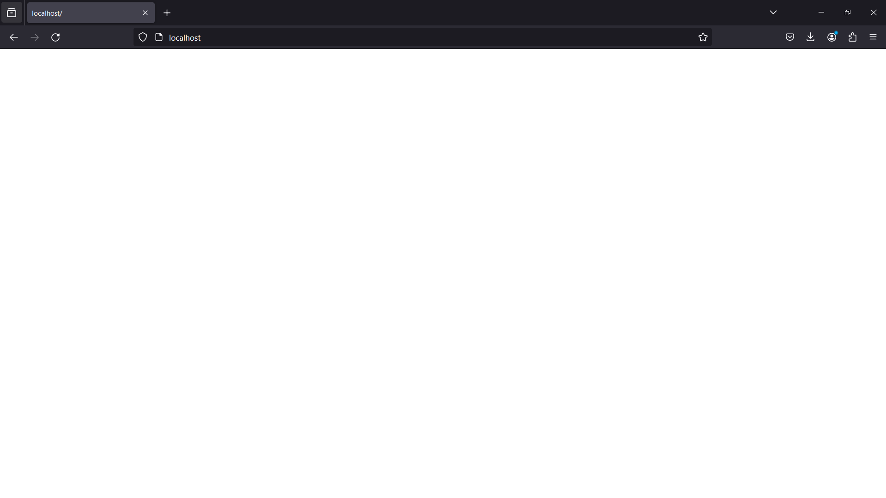

###### Nicolas METAIS

# Compte Rendu de TP Java


### Objectif

- Etudier et reproduire le comportement d’un serveur web

- Manipuler les sockets

- Manipuler les fichiers

- Créer une application multithread

## Ce n'est pas une chausette
Création des différentes classes:

#### WebServer.java :
```JAVA
public class WebServer {
    private void readRequest(Socket socket) {

        try {
            BufferedReader input = new BufferedReader(new InputStreamReader(socket.getInputStream()));
            String response = "";
            do {
                response = input.readLine();
                System.out.println(response);
            }while (!(response).isEmpty());
        }
        catch(Exception e){
            System.err.println(e.getMessage());
        }
    }

    private void sendResponse(Socket socket) {
        try {
            BufferedWriter output = new BufferedWriter(new OutputStreamWriter(socket.getOutputStream()));
            output.write("HTTP/1.0 200 OK \n\n ");

            output.flush();
        } catch (Exception e) {
            System.err.println(e.getMessage());
        }
    }
    public void run(int portNumber) {
        try {
            ServerSocket serverSocket = new ServerSocket(portNumber);
            System.out.println("Starting server on port " + portNumber);
            while (true) {
                Socket clientSocket = serverSocket.accept();
                readRequest(clientSocket);
                sendResponse(clientSocket);
                clientSocket.close();
            }

        } catch (Exception e) {
            System.err.println(e.getMessage());
        }

    }
}
```
#### WebServerApplication.java :
```JAVA
public class WebServerApplication {
    public static void main(String[] args) {
        WebServer webServer = new WebServer();
        webServer.run(80);
    }
}
```

On obtient bien alors une page blanche sur le navigateur.



et sur le terminal on obtient :
```
Starting server on port 80
GET / HTTP/1.1
Host: localhost
User-Agent: Mozilla/5.0 (Windows NT 10.0; Win64; x64; rv:124.0) Gecko/20100101 Firefox/124.0
Accept: text/html,application/xhtml+xml,application/xml;q=0.9,image/avif,image/webp,*/*;q=0.8
Accept-Language: fr,fr-FR;q=0.8,en-US;q=0.5,en;q=0.3
Accept-Encoding: gzip, deflate, br
Connection: keep-alive
Upgrade-Insecure-Requests: 1
Sec-Fetch-Dest: document
Sec-Fetch-Mode: navigate
Sec-Fetch-Site: none
Sec-Fetch-User: ?1
```

La requete client contient :

- une requete GET / HTTP/1.1 

- avec comme url : localhost
- le client accepte les fichiers :
  - text/html 
  - application/xhtml+xml 
  - application/xml;q=0.9 
  - image/avif
  - image/webp
  - \*/*;q=0.8
- le champ connection en keep-alive traduit le fait que le client souhaite garder la connexion ouverte pour d'autres requetes